<div align="center">



# 🚄 Awesome Rail Operations Management 🛤️

[](https://github.com/ishandutta2007/Awesome-Awesome-Awesome)
<a href="https://discord.gg/jc4xtF58Ve"></a>
[](https://github.com/ishandutta2007/Awesome-Rail-Operations-Management/stargazers)
[](https://github.com/ishandutta2007/Awesome-Rail-Operations-Management/network/members)
[](https://github.com/ishandutta2007/Awesome-Rail-Operations-Management/pulls)
[](https://opensource.org/licenses/MIT)
<a href="https://github.com/ishandutta2007"></a>

<p align="center">
  <b>Curated directory of Enterprise SaaS Platforms, Open-Source Software, Simulation Engines, and Optimization Toolkits for Railway Operations, Dispatching, Timetable Planning, and Asset Intelligence.</b>
</p>

---

</div>

## 📌 Executive Overview & Ecosystem Scope

This repository provides an authoritative, SEO-indexed directory of **Commercial SaaS / Hosted Railway Software** and **Open-Source GitHub Repositories** powering modern railway networks. 

These technologies empower **infrastructure managers (IMs)**, **passenger rail operators (TOCs)**, **freight rail carriers**, **transit & metro agencies**, and **rolling-stock maintainers** with:
- 🚦 **Train Control & Automated Dispatching (CAD / TMS / ATS)**
- ⏱️ **Microscopic Timetable Planning, Slot Allocation & Conflict Detection**
- 📈 **Dynamic Network Capacity Analysis & Headway Simulation**
- 🔧 **Predictive Fleet Maintenance & Digital Twin Telemetry (CBM / PHM)**
- 👥 **Crew Rostering, Vehicle Blocking & Operational Disruption Recovery**

---

## 📑 Table of Contents

- [🏢 Enterprise SaaS & Hosted Platforms](#-enterprise-saashosted-platforms)
  - [📊 Market Size & Industry Concentration](#-market-size--industry-concentration)
  - [💼 SaaS Comparison & Pricing Matrix](#-saas-comparison--pricing-matrix)
- [🔓 Open-Source GitHub Projects](#-open-source-github-projects)
- [🛠️ Mathematical Optimization & Simulation Libraries](#-mathematical-optimization--simulation-libraries)
- [🗺️ Geospatial Data & Mapping Infrastructure](#-geospatial-data--mapping-infrastructure)
- [🏗️ Blueprint: Building a Self-Hosted Rail Operations Stack](#️-blueprint-building-a-self-hosted-rail-operations-stack)
- [⭐ Star History](#-star-history)
- [🤝 How to Contribute](#-how-to-contribute)
- [⚠️ Disclaimer](#️-disclaimer)

---

## 🏢 Enterprise SaaS/Hosted Platforms

### 📊 Market Size & Industry Concentration

> **Market Sizing & Structure Analysis:**
> The global **Railway Operations & Rail Traffic Management Software Market** is valued at approximately **$14.2 Billion** (growing at a CAGR of ~8.8% toward $26.5 Billion by 2032). The sector exhibits a **moderately to highly concentrated oligopoly** at the core safety-critical layer—dominated by Tier-1 rail & automation conglomerates (*Siemens, Hitachi Rail, Thales/Hitachi, Alstom*) for mission-critical Traffic Management Systems (TMS), Computer-Aided Dispatching (CAD), and Signalling Control—combined with a **moderately fragmented, highly specialized ecosystem** of mid-tier enterprise software providers (*Bentley, Trapeze, Cubic, IVU, GIRO, HaCon, RMCon, RailCube*) competing in timetable optimization, crew rostering, capacity simulation, passenger fare intelligence, and freight asset management.

### 💼 SaaS Comparison & Pricing Matrix

*The table below ranks commercial SaaS and enterprise hosted rail platforms sorted descending by vendor scale (Revenue / Valuation).*

| 🏢 Product / Platform | 🎯 Primary Domain & Key Capabilities | 🌐 Company Scale (Rev / Valuation) | 💵 Pricing (Starting Tier) | 🎁 Free Tier / Free Trial Limits |
| :--- | :--- | :--- | :--- | :--- |
| **[Siemens Railigent X](https://www.siemens.com/railigent)** | Digital rail asset intelligence, fleet predictive maintenance, IoT telemetry pipelines, and decision-support APIs. | **~$85.7B (€78.9B) Rev** / ~$150B Market Cap | **$25,000 / year** base application suite & connectivity pack (up to 10 connected rail assets) | **30-day guided evaluation trial** (limited to 1 fleet subset / 5 connected vehicle telemetry streams) |
| **[Siemens Rail Operations Centre / TMS](https://www.mobility.siemens.com/)** | Network-wide traffic management systems (TMS), centralized train dispatching, conflict prediction, and automated routing. | **~$85.7B (€78.9B) Rev** / ~$150B Market Cap | **$50,000 / year** base traffic management system & dispatch coordinator module | **30-day evaluation environment** (virtual control center simulator, up to 2 dispatch operators) |
| **[Hitachi Rail (HMAX Platform)](https://www.hitachirail.com/)** | Integrated operations control, HMAX digital asset management platform, signalling supervision, and operational AI analytics. | **~$72.4B (¥10.6T) Rev** / ~$90B Market Cap | **$50,000 / year** base digital asset intelligence & monitoring package for regional operators | **30-day proof-of-concept trial** (limited to 1 monitored line section / 20 telemetry sensor feeds) |
| **[Thales Ground Transportation Systems](https://www.thalesgroup.com/)** | Rail traffic management, digital signalling, automated train supervision (ATS), and central command communications. | **~$24.1B (€22.1B) Rev** / ~$35B Market Cap | **$60,000 / year** digital rail supervision & network analytics starter package | **30-day proof-of-concept cloud access** (simulated rail corridor, up to 10 virtual signal blocks) |
| **[Alstom HealthHub](https://www.alstom.com/)** | Cloud-based rolling-stock health monitoring, predictive maintenance algorithms, wayside detectors, and asset analytics. | **~$20.2B (€18.5B) Rev** / ~$7B Market Cap | **$40,000 / year** foundation diagnostics & fleet analytics tier for regional fleets | **30-day evaluation trial** (limited to 1 trainset unit / 10 subsystem diagnostic sensor parameters) |
| **[Alstom ICONIS](https://www.alstom.com/)** | Integrated control and supervision center platform for mainline and metro networks, automated traffic regulation, and SCADA. | **~$20.2B (€18.5B) Rev** / ~$7B Market Cap | **$55,000 / year** integrated traffic management & control center foundation system | **30-day pilot sandbox** (test ATS workstation instance, limited to 1 virtual control sector) |
| **[Trapeze Rail](https://www.trapezegroup.com/)** | Rail transit operations, timetabling, vehicle block optimization, automated crew rostering, and computer dispatching. | **~$8.4B (CAD 11.4B) Rev** *(Constellation)* / ~$70B Market Cap | **$35,000 / year** base rail scheduling & workforce management starter package | **30-day sandbox pilot** (up to 2 planner accounts, limited to 1 line timetable model) |
| **[Cubic Transportation Systems](https://www.cubic.com/transportation)** | Intelligent transit operations, automated fare collection, real-time passenger information, and traffic control integration. | **~$1.50B Rev** / $3.0B Enterprise Valuation | **$1,500 / month** ($18,000 / year) base agency platform fee plus operational ticketing services | **30-day sandbox trial** (test agency account, simulated rider transactions, up to 5 virtual station validators) |
| **[Bentley OpenRail](https://www.bentley.com/)** | Railway engineering, track design, civil infrastructure, BIM modeling, surveying, and corridor planning. | **~$1.50B Rev** / ~$15B Market Cap | **$9,383 / year** (Virtuoso 12-month practitioner license via eStore) | **14-day free trial** (1 named user, standard sample railway dataset, cloud sandbox) |
| **[IVU.rail](https://www.ivu.com/)** | Integrated railway operations suite covering timetables, rolling stock assignment, crew dispatching, and disruption recovery. | **~$135M (€122M) Rev** / ~$300M Market Cap | **€30,000 / year** starter timetable and rolling-stock duty module for regional operators | **30-day evaluation pilot** (cloud test environment, up to 2 planning seats, 1 regional schedule dataset) |
| **[Tracsis / RailComm](https://tracsisus.com/)** | Computer-aided dispatching (CAD), positive train control (PTC) interfaces, yard automation, and remote condition monitoring. | **~$110M (£82M) Rev** / ~$350M Market Cap | **$30,000 / year** baseline dispatching and yard management system for shortlines | **30-day guided demonstration trial** (virtual dispatch sandbox, up to 2 active consoles, 1 track territory) |
| **[GIRO HASTUS](https://www.giro.ca/)** | Rail transit scheduling suite, timetable development, run-cutting, crew rostering, and daily operational dispatch. | **~$100M+ Rev** / ~$400M Valuation | **$45,000 / year** core rail scheduling, vehicle blocking, and crew rostering module | **30-day proof-of-concept environment** (up to 2 planner logins, limited to 1 division schedule model) |
| **[HaCon TPS](https://www.hacon.de/)** | Train planning and capacity management technology, macroscopic/microscopic timetable synthesis, and infrastructure slotting. | **~$60M+ Rev** *(Siemens Mobility unit)* | **€28,000 / year** base train planning system starter module for regional networks | **14-day structured test sandbox** (1 user license, demo rail corridor, capped at 50 train paths) |
| **[RailSys](https://www.rmcon.de/)** | Timetable construction, track possession planning, infrastructure constraints, slot management, and network capacity analysis. | **~$12M Rev** / ~$30M Valuation | **€8,500 / year** single-user workstation base license for infrastructure & timetable modules | **14-day evaluation license** (single workstation, restricted to 1 sample network model, export disabled) |
| **[OpenTrack Railway Technology](https://www.opentrack.ch/)** | Railway microscopic simulation, timetable stability modeling, headway & capacity analysis, and conflict detection. | **~$7M Rev** / ~$20M Valuation | **CHF 7,200 / year** (~$8,100 / year) commercial single-seat workstation license (CHF 2,400 / year academic) | **14-day evaluation license** (single workstation, capped at 10 simulated trains and 20 km network track) |
| **[RailCube](https://www.railcube.com/)** | Rail freight operations, train & path planning, fleet tracking, locomotive/wagon asset monitoring, and crew dispatch. | **~$5M Rev** / ~$18M Valuation | **€1,200 / month** (~€14,400 / year) for base rail freight & asset operations module | **14-day guided pilot trial** (1 sandbox organization, up to 3 dispatcher seats, sample fleet) |

---

## 🔓 Open-Source GitHub Projects

*Ranked descending by GitHub Star count. Badges link directly to each repository's stargazers.*

* **[NetworkX](https://github.com/networkx/networkx)** [](https://github.com/networkx/networkx/stargazers) `17k+ ⭐`  
  Python library for the study of complex networks, graph topology algorithms, shortest-path calculation, and railway network connectivity analysis. *(3-Clause BSD)*

* **[QGIS](https://github.com/qgis/QGIS)** [](https://github.com/qgis/QGIS/stargazers) `14k+ ⭐`  
  Leading open-source Geographic Information System (GIS) widely utilized for railway track alignment mapping, right-of-way spatial analysis, and corridor asset visualization. *(GPL-2.0)*

* **[Google OR-Tools](https://github.com/google/or-tools)** [](https://github.com/google/or-tools/stargazers) `13k+ ⭐`  
  Fast, portable suite for solving combinatorial optimization problems; industry standard for custom railway timetabling, locomotive routing, and crew scheduling engines. *(Apache-2.0)*

* **[OpenTTD](https://github.com/OpenTTD/OpenTTD)** [](https://github.com/OpenTTD/OpenTTD/stargazers) `6k+ ⭐`  
  Open-source simulation game engine modeling complex multi-line rail routing, block and path signalling systems, network junctions, and freight logistics. *(GPL-2.0)*

* **[SUMO (Simulation of Urban MObility)](https://github.com/eclipse-sumo/sumo)** [](https://github.com/eclipse-sumo/sumo/stargazers) `4k+ ⭐`  
  Continuous multi-modal microscopic traffic simulator capable of simulating large-scale railway networks, train physics, dwell times, and intermodal transfers. *(EPL-2.0)*

* **[OpenStreetMap Core](https://github.com/openstreetmap/openstreetmap-website)** [](https://github.com/openstreetmap/openstreetmap-website/stargazers) `2.8k+ ⭐`  
  The collaborative worldwide mapping database powering global railway infrastructure data, rail geometries, station coordinates, and switch nodes. *(GPL-2.0)*

* **[Pyomo](https://github.com/Pyomo/pyomo)** [](https://github.com/Pyomo/pyomo/stargazers) `2.5k+ ⭐`  
  Python-based mathematical modeling package for formulating mixed-integer linear programming (MILP) formulations of train path scheduling and disruption management. *(BSD-3-Clause)*

* **[PostGIS](https://github.com/postgis/postgis)** [](https://github.com/postgis/postgis/stargazers) `2.2k+ ⭐`  
  Spatial database extender for PostgreSQL providing high-performance indexing and querying for railway lines, mileposts, grade crossings, and track geometry. *(GPL-2.0)*

* **[Timefold Solver](https://github.com/TimefoldAI/timefold-solver)** [](https://github.com/TimefoldAI/timefold-solver/stargazers) `1.7k+ ⭐`  
  Open-source AI constraint solver for complex vehicle routing, train maintenance scheduling, platform allocation, and employee shift rostering. *(Apache-2.0)*

* **[MobilityDB](https://github.com/MobilityDB/MobilityDB)** [](https://github.com/MobilityDB/MobilityDB/stargazers) `1.1k+ ⭐`  
  Geospatial trajectory database engine extending PostgreSQL/PostGIS for managing temporal and moving-object data, such as real-time train GPS locations and speed profiles. *(MPL-2.0)*

* **[OSRD (Open Source Railway Designer)](https://github.com/OpenRailAssociation/osrd)** [](https://github.com/OpenRailAssociation/osrd/stargazers) `650+ ⭐`  
  Flagship web application for railway infrastructure design, electrical & braking simulation, capacity calculation, conflict detection, and timetable generation developed by OpenRail Association and SNCF. *(LGPL-3.0)*

* **[MATSim](https://github.com/matsim-org/matsim-libs)** [](https://github.com/matsim-org/matsim-libs/stargazers) `640+ ⭐`  
  Multi-Agent Transport Simulation framework for large-scale agent-based passenger demand modeling, timetable testing, and network congestion evaluation. *(GPL-2.0)*

* **[OpenRailwayMap](https://github.com/OpenRailwayMap/OpenRailwayMap)** [](https://github.com/OpenRailwayMap/OpenRailwayMap/stargazers) `510+ ⭐`  
  Global open railway infrastructure map visualizing tracks, electrification systems, signalling layouts, gauges, and speed restrictions based on OpenStreetMap. *(GPL-3.0)*

* **[JOSM (Java OpenStreetMap Editor)](https://github.com/openstreetmap/josm)** [](https://github.com/openstreetmap/josm/stargazers) `440+ ⭐`  
  Extensible offline desktop editor used extensively by the railway GIS community to digitize track schematics, signals, and turnout geometries. *(GPL-2.0)*

* **[OpenRails](https://github.com/openrails/openrails)** [](https://github.com/openrails/openrails/stargazers) `320+ ⭐`  
  Free, open-source train simulator platform modeling physics, signaling systems, multi-player operations, and train performance dynamics. *(GPL-3.0)*

* **[Netzgrafik-Editor](https://github.com/OpenRailAssociation/netzgrafik-editor-frontend)** [](https://github.com/OpenRailAssociation/netzgrafik-editor-frontend/stargazers) `80+ ⭐`  
  Web application for designing, editing, and validating regular-interval train timetables (Netzgrafik) and periodic public transit service networks. *(AGPL-3.0)*

* **[Flatland-RL](https://github.com/flatland-association/flatland-rl)** [](https://github.com/flatland-association/flatland-rl/stargazers) `70+ ⭐`  
  Multi-agent reinforcement learning benchmark environment developed by Swiss Federal Railways (SBB), AIcrowd, and Deutsche Bahn (DB) for train scheduling and re-routing algorithms. *(MIT)*

* **[Railway Operation Simulator (RailOS)](https://github.com/AlbertBall/railway-dot-exe)** [](https://github.com/AlbertBall/railway-dot-exe/stargazers) `40+ ⭐`  
  Railway simulation tool allowing users to build track layouts, define interlocking logic, design timetables, operate trains, and inject operational delays. *(GPL-2.0)*

* **[OpenRailwayMap Vector](https://github.com/giopera/OpenRailwayMap-vector)** [](https://github.com/giopera/OpenRailwayMap-vector/stargazers) `50+ ⭐`  
  Vector-tile client for OpenRailwayMap enabling high-DPI rendering of railway signals, maximum permissible speeds, and track electrification. *(MIT)*

* **[openSignalBox](https://github.com/opensignalbox)** [](https://github.com/opensignalbox/opensignalbox/stargazers) `45+ ⭐`  
  Modular railway signaling simulation project modeling lever frames, interlocking tables, and signal box control panels. *(GPL-3.0)*

* **[TS2 Train Signalling Simulator](https://github.com/ts2)** [](https://github.com/ts2/ts2/stargazers) `30+ ⭐`  
  Railway signaling and dispatching simulator allowing users to control signal routes, regulate headways, and manage traffic over varied topologies. *(GPL-3.0)*

* **[Railway Signaling System](https://github.com/MenakaGodakanda/railway_signaling_system)** [](https://github.com/MenakaGodakanda/railway_signaling_system/stargazers) `2+ ⭐`  
  C++ educational simulation engine illustrating track block state transitions, route locking, and collision prevention. *(MIT)*

* **[Robust Railway](https://github.com/transp-or/Robust_Railway)** [](https://github.com/transp-or/Robust_Railway/stargazers) `1+ ⭐`  
  EPFL research framework for railway timetable rescheduling under major disruptions using heuristic and exact optimization algorithms. *(GPL-3.0)*

* **[TrainApp](https://github.com/sairam4123/TrainApp)** [](https://github.com/sairam4123/TrainApp/stargazers) `1+ ⭐`  
  Go-based railway network simulator modeling track reservations, speed profiles, and deadlock resolution. *(MIT)*

* **[Railway Scheduling](https://github.com/marcotallone/railway-scheduling)** [](https://github.com/marcotallone/railway-scheduling/stargazers) `1+ ⭐`  
  Operations research project optimizing railway maintenance possession windows while minimizing network delay propagation. *(MIT)*

---

## 🛠️ Mathematical Optimization & Simulation Libraries

| Library / Tool | Primary Capabilities & Use Case | Language |
| :--- | :--- | :--- |
| **[google/or-tools](https://github.com/google/or-tools)** | Vehicle routing problem (VRP), integer programming for crew & rolling-stock duty assignments | C++, Python, Java, C# |
| **[Timefold Solver](https://github.com/TimefoldAI/timefold-solver)** | Dynamic constraint satisfaction for railway crew rostering, platform slotting, and depot maintenance | Java, Kotlin, Python |
| **[Pyomo](https://github.com/Pyomo/pyomo)** | Algebraic modeling for complex timetable stability, passenger delay minimization, and track slotting | Python |
| **[NetworkX](https://github.com/networkx/networkx)** | Network graph metrics, headway capacity constraints, shortest-path rerouting under block closures | Python |
| **[eclipse-sumo/sumo](https://github.com/eclipse-sumo/sumo)** | Microscopic multi-modal simulation of railway corridors, grade crossings, and intermodal hubs | C++, Python |
| **[matsim-org/matsim-libs](https://github.com/matsim-org/matsim-libs)** | Agent-based dynamic passenger assignment and network disruption impact modeling | Java |
| **[railML](https://www.railml.org/)** | Open XML-based data exchange format for infrastructure, rolling stock, timetables, and interlocking | XML / Schemas |

---

## 🗺️ Geospatial Data & Mapping Infrastructure

| Platform / Tool | Operational Focus | Ecosystem Role |
| :--- | :--- | :--- |
| **[OpenRailwayMap](https://github.com/OpenRailwayMap/OpenRailwayMap)** | Global railway infrastructure rendering | Map layer visualizing tracks, speeds, gauges, and signals |
| **[MobilityDB](https://github.com/MobilityDB/MobilityDB)** | Moving-train spatio-temporal queries | High-scale database engine for real-time train telemetry |
| **[PostGIS](https://github.com/postgis/postgis)** | Spatial analytics database | Geospatial queries for track segments, buffers, and switches |
| **[QGIS](https://github.com/qgis/QGIS)** | Desktop GIS analysis | Track survey data import, corridor mapping, and BIM overlay |
| **[OpenStreetMap](https://github.com/openstreetmap/openstreetmap-website)** | Open crowd-sourced geographic foundation | Base spatial topology and geographic railway asset coordinates |

---

## 🏗️ Blueprint: Building a Self-Hosted Rail Operations Stack

For transit agencies, academic researchers, and innovative rail operators seeking to construct an **open, vendor-independent Rail Operations Platform**:

```text
┌─────────────────────────────────────────────────────────────────────────┐
│                    OPERATOR / USER INTERFACE LAYER                      │
│   Netzgrafik-Editor (Timetabling)  │  OSRD Web UI (Capacity & Design)   │
└────────────────────────────────────┬────────────────────────────────────┘
                                     │
┌────────────────────────────────────▼────────────────────────────────────┐
│                  OPTIMIZATION & DISPATCH ENGINE LAYER                   │
│   Timefold / OR-Tools (Scheduling) │  Flatland / SUMO (Sim & Rerouting) │
└────────────────────────────────────┬────────────────────────────────────┘
                                     │
┌────────────────────────────────────▼────────────────────────────────────┐
│                  DATA INTEROPERABILITY & SCHEMAS                        │
│                railML Standards  │  GTFS / GTFS-Realtime                │
└────────────────────────────────────┬────────────────────────────────────┘
                                     │
┌────────────────────────────────────▼────────────────────────────────────┐
│                    GEOSPATIAL & TELEMETRY BACKEND                       │
│     PostgreSQL + PostGIS + MobilityDB (Spatio-Temporal Telemetry)       │
│     OpenRailwayMap + OpenStreetMap (Global Track & Signal Assets)       │
└─────────────────────────────────────────────────────────────────────────┘
```

---

## ⭐ Star History

[](https://star-history.dera.page/#ishandutta2007/Awesome-Rail-Operations-Management&type=date&legend=top-left)

---

## 🤝 How to Contribute

We welcome contributions from rail operations researchers, software engineers, transit planners, and industry professionals!

1. 🍴 **Fork the repository**.
2. 🌿 **Create a new branch** (`git checkout -b feature/new-rail-tool`).
3. 📝 **Add your entry** to the appropriate section following the established format:
   - For SaaS tools: include Company Scale, starting tier price, and exact free trial / evaluation terms.
   - For Open-Source tools: include GitHub repository link, star badge linked to stargazers, and license.
4. 🚀 **Submit a Pull Request** with a concise description of the tool's rail operations relevance.

---

## ⚠️ Disclaimer

- This list is **community-curated** for educational, technical, and informational purposes.
- Mission-critical railway dispatching, interlocking, and automated train control (ATC/ATP) require rigorous SIL-4 safety certification, fail-safe redundancy, and regulatory compliance.
- Commercial software pricing and specifications are subject to vendor updates and contractual agreements.

---

<div align="center">
  <b>Made with ❤️ for railway operators, timetable planners, dispatchers, transit agencies, and rail technologists worldwide.</b>
</div>